# Locally Twisted Balloon Color Addendum

**Date:** 2026-05-22
**Applies to:** product drawers, color-chart work, generated shop/category hero briefs, customer-facing color matching, and any design asset that represents LT balloon colors.

This addendum belongs to the main style guide. It exists because balloon colors are product truth, not decorative website colors.

## Authority Order

1. **Owner/Odoo swatch image and exact source color name.** This is the authority for generated images and customer-facing balloon matching.
2. **Supplier-style balloon color naming.** Names such as `Reflex Champagne`, `Dusk Green Tea`, and `Pastel Melon` must be passed to image prompts in text. Do not brief only with hex.
3. **Best web-match hex.** Hex is a CSS/customer approximation sampled from the local Odoo swatch image. It helps businesses match closely on screens and documents, but it is not the balloon authority.

External vendor context: Sempertex's public product pages use the same kind of texture/color naming, including [Reflex Champagne](https://sempertex.com/en/products/globo-para-fiesta-latex-redondo-reflex-champana), and its color articles name lines such as [Dusk Green Tea](https://sempertex.com/en/blogs/enterate/verde-te-y-verde-aurora). The LT source of truth remains the local Odoo export and owner swatch map.

## Verified Source

Source files:

- `_resources/odoo-live/catalog.json`
- `apps/locally_twisted/locally_twisted/catalog_contract/odoo_color_swatch_map.json`
- `apps/locally_twisted/locally_twisted/public/images/color-swatches/odoo/`

Verification command:

```powershell
python scripts\verify\odoo_color_swatch_contract.py
```

Current verified result:

- `latex colors` drawer exposes 53 owner/Odoo options.
- 51 distinct source swatch images are used for those 53 options.
- `Blue Slate` / `Blue slate` share one source swatch.
- `Smoke Grey` / `Smoke grey` share one source swatch.
- The product drawer groups the colors into 8 drawers: Reflex, Dusk, Pastels, Blues + Teals, Greens, Pinks + Purples, Neutrals, and Brights.

## Generated Image Rule

When generating category hero images, the prompt must include:

- the category shape, for example balloon columns, balloon arch, balloon bouquet, table decor, drop, easel/stand, or delivery arrangement;
- the relevant balloon color names from this addendum;
- the owner/Odoo swatch image references or contact sheet when the generation workflow supports image references;
- the target hero ratio and breakpoint crop, not a generic square or portrait composition.

Do not prompt only with hex values. Do not let the model invent unnamed colors. If the result does not visually match the source swatches, regenerate or reject it.

## Color Catalog

### Reflex

| Swatch | Source balloon color name | Web-match hex | Notes |
|---|---|---:|---|
| 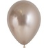 | Reflex Champagne | `#B19F94` |  |
| 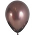 | Reflex Truffle | `#7A615F` |  |
| 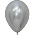 | Reflex Silver | `#9A9D9C` |  |
| 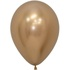 | Reflex Gold | `#AB8B69` |  |
|  | Reflex Blue | `#437A95` |  |
| 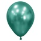 | Reflex green | `#519589` |  |
| 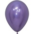 | Reflex Violet | `#796997` |  |
|  | Reflex Red | `#D14C3C` |  |

### Dusk

| Swatch | Source balloon color name | Web-match hex | Notes |
|---|---|---:|---|
| 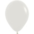 | Dusk Cream | `#C5C5B9` |  |
| 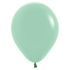 | Dusk Green Tea | `#A7D2BC` |  |
| 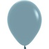 | Dusk Blue | `#80A0AB` |  |
|  | Dusk Lilac | `#B795B4` |  |
|  | Dusk Rose | `#D5ABC4` |  |

### Pastels

| Swatch | Source balloon color name | Web-match hex | Notes |
|---|---|---:|---|
|  | Pastel Pink | `#F5DFE6` |  |
|  | Pastel Blue | `#AADAF2` |  |
| 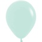 | Pastel Green | `#C7E6DE` |  |
|  | Pastel Purple | `#D5CFE4` |  |
|  | Pastel Yellow | `#F9F5CF` |  |
|  | Pastel Melon | `#F9C6BF` |  |

### Blues + Teals

| Swatch | Source balloon color name | Web-match hex | Notes |
|---|---|---:|---|
|  | Teal | `#50C3C0` |  |
| 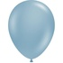 | Blue Slate | `#98B8C8` |  |
|  | LT Blue | `#2AC7F1` |  |
|  | Periwinkle | `#6E75B6` |  |
|  | Royal Blue | `#1467AB` |  |
|  | Robin's Egg | `#73C6C5` |  |
| 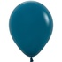 | Deep Teal | `#176078` |  |
|  | Blue slate | `#98B8C8` | Source duplicate of `Blue Slate`; same swatch. |

### Greens

| Swatch | Source balloon color name | Web-match hex | Notes |
|---|---|---:|---|
|  | eucalyptus | `#99AC89` |  |
|  | Forest | `#178A5E` |  |
| 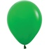 | Shamrock | `#29AE59` |  |
|  | Wintergreen | `#52BF99` |  |
|  | Lime | `#9BCB73` |  |
| 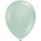 | Empowermint | `#BAD0C3` |  |

### Pinks + Purples

| Swatch | Source balloon color name | Web-match hex | Notes |
|---|---|---:|---|
|  | raspberry | `#EE4872` |  |
|  | fuchsia | `#E572AA` |  |
|  | bubble Gum | `#F6B2D2` |  |
|  | Violet | `#5D3B8B` |  |
|  | Orchid | `#A9348F` |  |
|  | Lilac | `#AB98C9` |  |
| 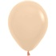 | Blush | `#EFD1B4` |  |

### Neutrals

| Swatch | Source balloon color name | Web-match hex | Notes |
|---|---|---:|---|
| 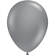 | Smoke Grey | `#929397` |  |
|  | White | `#DBE9EF` |  |
| 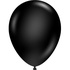 | black | `#2F2F2F` |  |
| 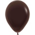 | Chocolate | `#47312E` |  |
| 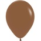 | Brown | `#916749` |  |
| 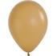 | Latte | `#C8A26A` |  |
| 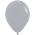 | Grey | `#B1B3B9` |  |
| 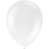 | Clear | `#ECECEC` |  |
|  | Smoke grey | `#929397` | Source duplicate of `Smoke Grey`; same swatch. |

### Brights

| Swatch | Source balloon color name | Web-match hex | Notes |
|---|---|---:|---|
|  | Red | `#EC373E` |  |
|  | Orange | `#F27C3A` |  |
|  | yellow | `#FAE348` |  |
|  | Honey | `#F2C72E` |  |
